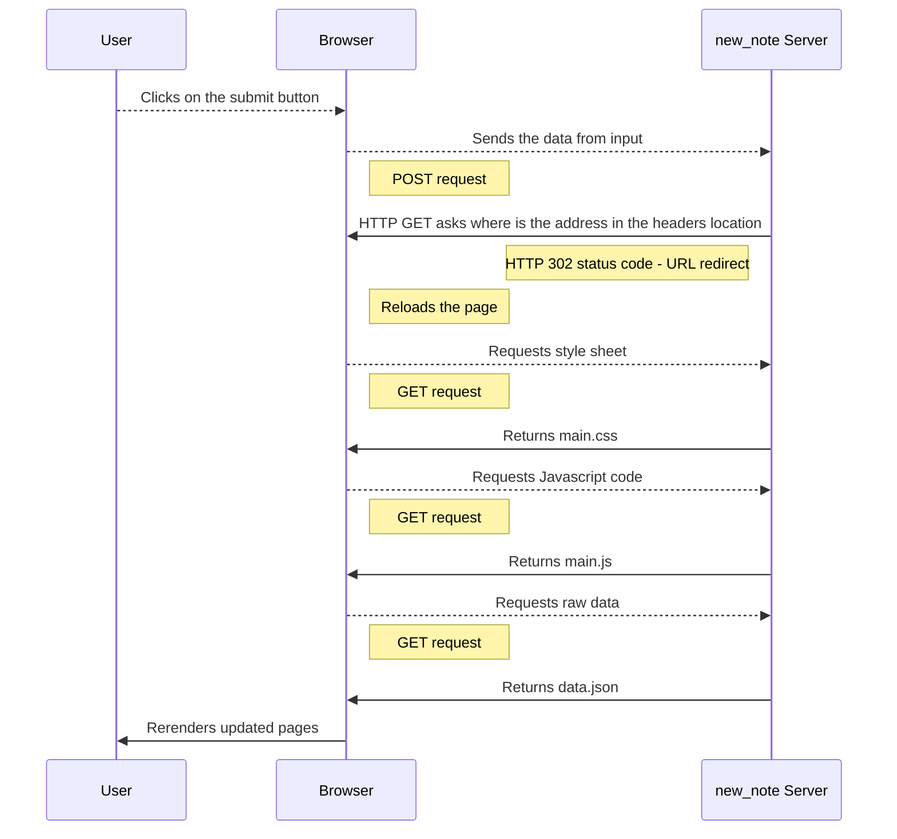

```mermaid
  sequenceDiagram
    User -->> Browser: Clicks on the submit button
    Browser -->> new_note Server: Sends the data from input
    note right of Browser: POST request
    new_note Server ->> Browser: HTTP GET asks where is the address in the headers location
    note left of new_note Server: HTTP 302 status code - URL redirect
    note right of Browser: Reloads the page
    Browser -->> new_note Server: Requests style sheet
    note right of Browser: GET request
    new_note Server ->> Browser: Returns main.css
    Browser -->> new_note Server: Requests Javascript code
    note right of Browser: GET request
    new_note Server ->> Browser: Returns main.js
    Browser -->> new_note Server: Requests raw data
    note right of Browser: GET request
    new_note Server ->> Browser: Returns data.json
    Browser ->> User: Rerenders updated pages
```
