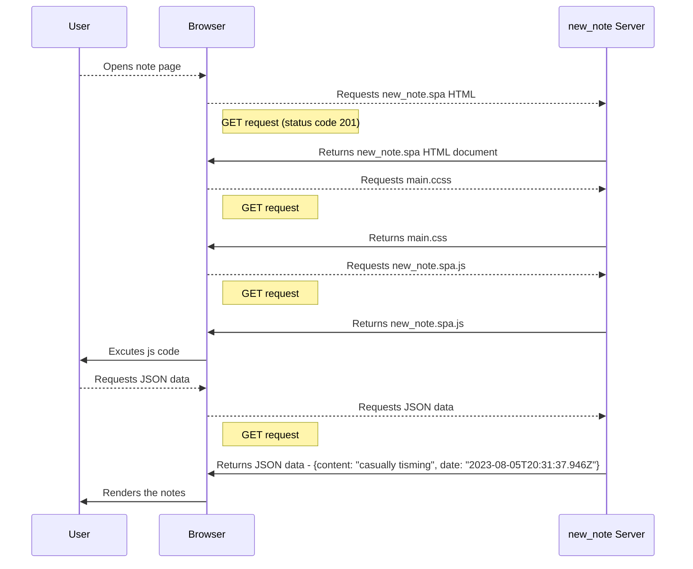

```mermaid
  sequenceDiagram
    User -->> Browser: Opens note page
    Browser -->> new_note Server: Requests new_note.spa HTML
    note right of Browser: GET request (status code 201)
    new_note Server ->> Browser: Returns new_note.spa HTML document
    Browser -->> new_note Server: Requests main.ccss
    note right of Browser: GET request
    new_note Server ->> Browser: Returns main.css
    Browser -->> new_note Server: Requests new_note.spa.js
    note right of Browser: GET request
    new_note Server ->> Browser: Returns new_note.spa.js
    Browser ->> User: Excutes js code 
    User -->> Browser: Requests JSON data
    Browser -->> new_note Server: Requests JSON data
     note right of Browser: GET request
    new_note Server ->> Browser: Returns JSON data - {content: "casually tisming", date: "2023-08-05T20:31:37.946Z"}
    Browser ->> User: Renders the notes

    
    
```
