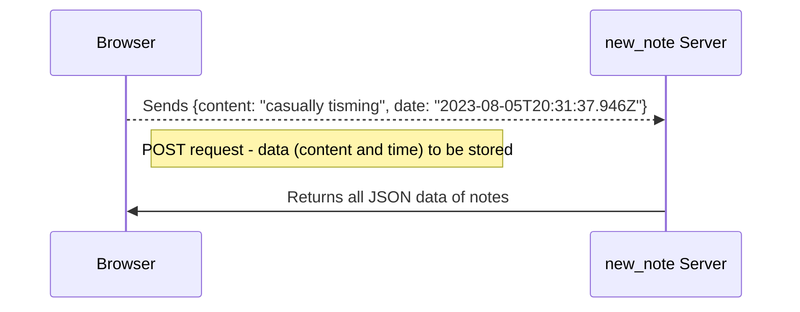

```mermaid 
    sequenceDiagram 
        Browser -->> new_note Server: Sends {content: "casually tisming", date: "2023-08-05T20:31:37.946Z"} 
        note right of Browser: POST request - data (content and time) to be stored
        new_note Server ->> Browser: Returns all JSON data of notes
```